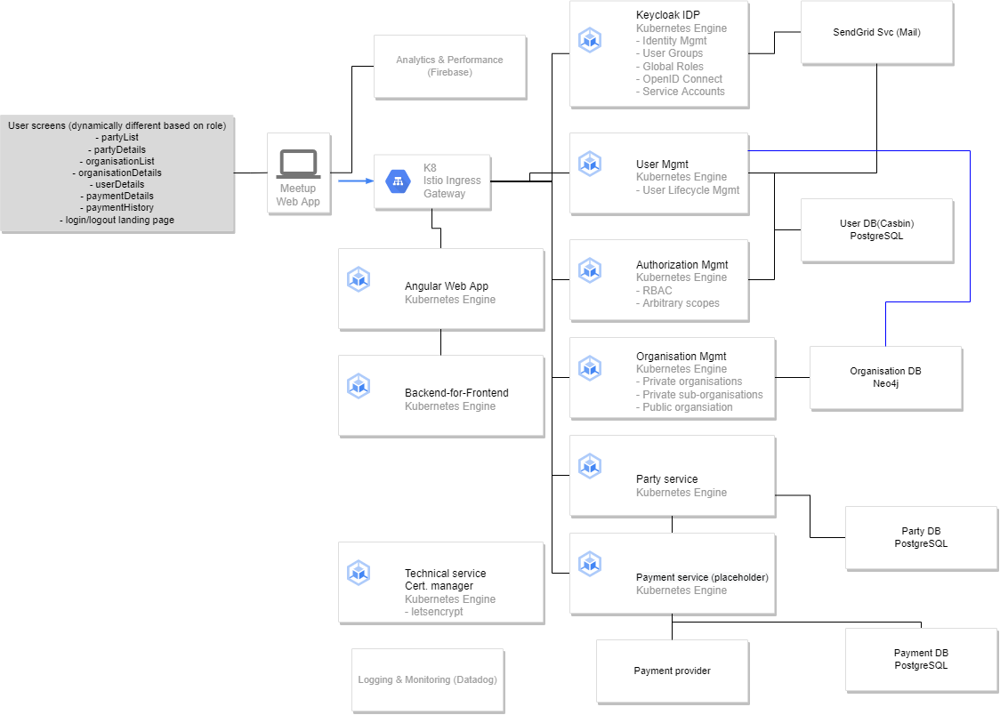
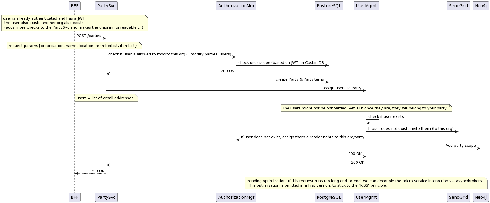

# Meetingz system

## Architecture overview

### Design choices
- Cloud provider: GCP (for price / skill reasons)
- Programming languages:
    - Node frontend, Angular
    - reason: wide adoption, easy to find skill able to build in Angular
    - Java for backend
    - reason: skill set of TPO (=me :) ); very wide adoption
        - "heaviness" of Java is starting to get addressed with recent frameworks (e.g. Quarkus)
    - good alternative: upskilling TPO and using NodeJS to leverage optimal team efficiency / learning curve / infrastructure harmonization
    - Terraform for IaC
- Programming style: test driven development (TDD)
- Culture: Agile (Kanban) + deliberate care modes;
- Design choices:
    - Custom build:
        - I've chosen to build a custom system, since this is what I'm familiar with for a web app. This stack optimizes for fine-grained control down the line (e.g. adding features) and integrateability into an enterprise context.
        - Alternatives considered:
            - Given more time, I'd check out more as-a-service based options that save on complexity and development time. For example, due to the payments requirement, it could be worth while to look into Shopify.
    - Keycloak + own user mgmt:
        - Allows for easy future flexibility (e.g. such as offering the service to private organisations / existing systems later on)
        - Good alternative: Using User Management completely as a service (e.g. frontegg.com)
            - using such a service would be faster, more expensive and potentially block some integrations later on
    - Organisation Mgmt:
        - Allows for multi-tenant setup of private parties (e.g. forming of groups); Alternative would be to have all private parties just belonging to the creator.
    - Monitoring: Datadog
        - Is expensive, but very convenient to use
        - Good alternative: Self-host Kiali, prometheus, jaeger, grafana as a cheap alternative (with more development & operating cost)
        - Not so good alternative: Cloud provider's native monitoring tools
    - Persistence
        - Neo4j for organisation setup, to add flexibility to future changes
        - PostgreSQL for users, since this is well suited to SQL/ACID DBs
        - PostgreSQL for parties and most this related: the clear structure of parties also match nicely to classic RDBMS solutions
    - Payment service placeholder
        - Adding a payment service is likely a solved problem and there are SaaS offerings to just use. However, I did take a shortcut here in the design and just assume that we would solve this later. For now a micro service just handles payments :)
    - e-Mail sending via sendgrip
        - cheap and quick option to get started, especially when used with custom domain
    - not added components
        - CDN: could be added if users are highly distributed and/or larger media is used
        - Queue / Broker pattern: in a simple version, synchronous service-to-service calls can be used to make sure that actions are fully executed
            - exception: Depending on the contract between payment service and payment provider we might want to add a queue here. The reason is that this process is longer running and must not fail.
    - DevOps stack: Azure DevOps Pipelines
        - reason: existing assets for pipelines :)
        - good alternative: gitlab, github actions

## Roadmap & timeline
### Requirements prior to starting development work at all
    - Business strategy well formulated
    - Timeline & hiring strategy formulated
    - Organisational setup complete (e.g. legal, payment, etc.)
    - Test user group at hand
### Phase 1: Testing UIX assumptions & prepare scale-up (~3 months)
    - Organisational tooling
    - Screen software (e.g. Invision)
    - Jira setup
    - Meeting tooling
    - User experience design
    - Including (most basic) screens
    - Building only frontend app with mocks / clickdummy in order to help test UIX and feature demand
    - Finishing technical architecture overview
    - Start preparing "agnostic" infrastructure
    - Onboarding guidelines for new-hires
    - Cloud infrastructure settings
        - dev / prod environment setup (manually)
        - roles & rights setup on Cloud
        - payment & reporting setup
    - first automation features (e.g. CI/CD)
        - minimum CI/CD for services (with public workers)
        - review process
### Phase 2: MVP to test & develop user interest with public parties (no revenue) ~3 months
    - mimimum automation features (e.g. CI/CD)
    - code quality measures
        - container scans
        - linting
        - library scans
        - test automation
    - core part of the system
    - user management
    - organisation of meetings
        - only public parties
        - core "catchy" feature: What each one brings to the party
### Phase 3: Hardening & Private parties beta ~3 months
    - SEO optimisation
    - CI/CD for infrastructure (IAC)
    - Quality improvements / removal of technical debt
    - Test environment setup (manually)
    - Private parties (for limited beta user group)
    - Security review
    - Adding more features based on user demand
### Phase 4: Payments & more feature add ~3 months
    - Private parties as general availability feature
    - Adding payments solution
    - Adding simple operations processes for private parties
    - ... more features ...

## Team composition & budget
- note: The team composition heaviliy impacts the timeline. Since no goal was defined regarding when to release what specific feature set, this composition is somewhat arbitrary
### roles
    - business & design roles
    - product owner (PO) & product manager (PM) (1 FTE): (1200€/day)
        - PO: Responsible for the features of the product & validating the deliverables
        - PM: Responsible for setting up wide-scale business plan, including sales & marketing, future business deals, roadmap-level features
    - technical product owner / lead engineer (TPO): (1200€/day)
    - senior frontend engineer (900€/day)
    - junior frontend engineer (700€/day)
    - senior backend engineer (900€/day)
        - ideally has DevOps experience as well
    - junior backend engineer (700€/day)
    - senior agile coach (1200€/day)
#### complementariy / at-request roles
    - security expert (1400€/day)
    - seo / marketing expert (1000€/day)
    - designer (1000€/day)
    - senior architecture expert (VC service or 1600€/day)
    - senior business case expert (VC service or 2500€/day)

### budget planning
    - note: Budget planning does only reflect a *plan* for the budget. Actual salaries may differ entirely (e.g. because there is a flat salary for all :) )
#### Phase 1 (3 months):
    - 1 FTE designer => UIX
    - 1/2 FTE senior frontend engineer (second half) => onboarding & dummy screens
    - 1/2 FTE senior backend engineer (second half) => onboarding & helping infrastructure setup
    - 1 FTE PO/PM => UIX & backlog creation
    - 1 FTE TPO => infrastructure setup, technical design & backlog creation
    - 1/2 FTE Senior agile coach => way-of-working setup & backlog creation
    - 5 days senior architecture expert (for review workshops)
    - 5 days senior business case expert (for review workshops)
#### Phase 2 (3 months):
    - changes to previous phase
        - scale down designer to 1/4 FTE => because initial UIX should nearing it's finish
        - scale up full engineering team
        - 2 frontend engineers (senior + junior)
        - 2 backend engineers (senior + junior)
        - TPO
        - scale down to 1 day: senior architecture expert (for PI change) 
        - scale down to 1 day: senior business case expert (for PI change)
#### Phase 3 (3 months):
    - changes to previous phase
        - one time spent: 10 days security expert
        - scale down designer to 0 FTE / ad-hoc work
#### Phase 4 (3 months): 
    - same as phase 2

## Comments

Here's my timeboxing approach:
- 3.5h architecture design (as suggested)
- 30min sketching what to implement (=> basic party svc API)
- 4h coding
  - out of which I had 2.5hrs fighting the dev machine setup (ended up re-installing Docker)
  - left with ~1.5hrs I decided not being able to finish anything useful and to focus on the design
    - some cases to showcase TDD
    - writing comments to outline the code, to instead touch on things I care about in the code
      - async programming style
      - mocking / separation of IT and unit tests
      - proper POJO modeling

## Usage

Running `docker compose up -d` should be all that's required. Just there is not much to run...

In the docker compose, there is still a bug that makes quarkus refuse to build.
Manually it builds fine:
` docker build -f be-service-partyplanner/src/main/docker/Dockerfile.jvm -t quarkus/be-service-partyplanner-jvm be-service-partyplanner/.`

## (Planned) Implementation
